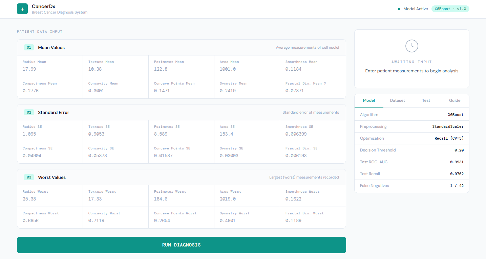
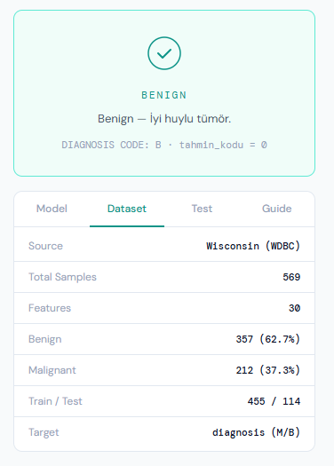
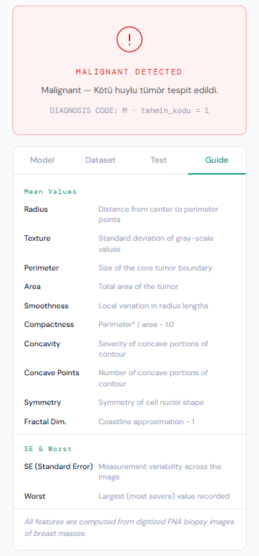
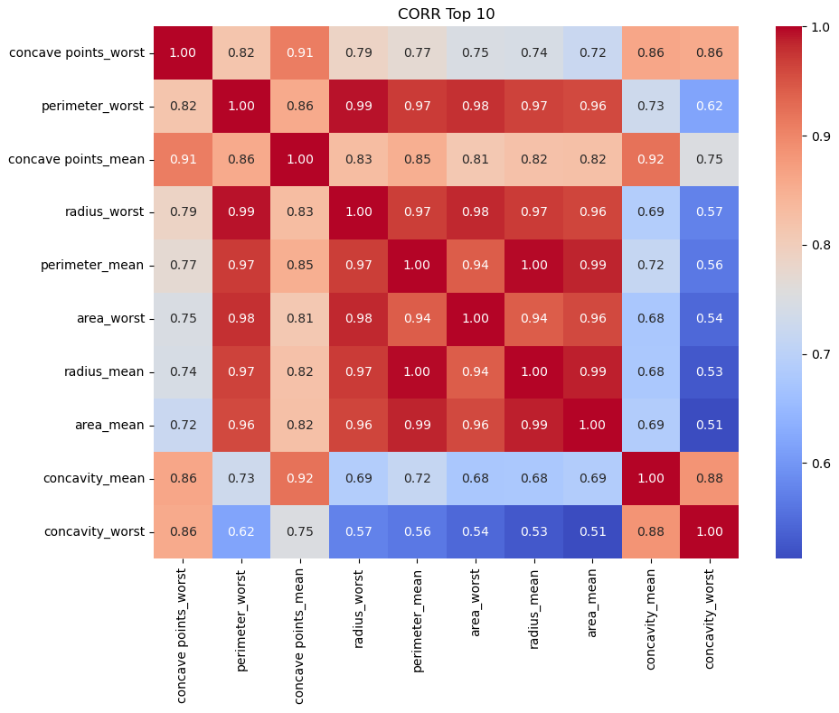
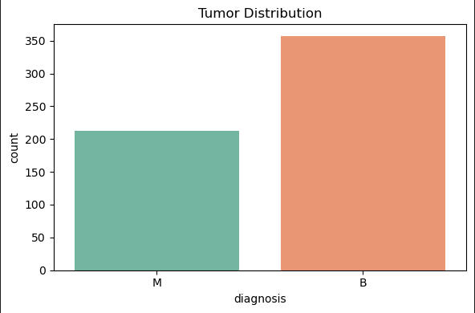
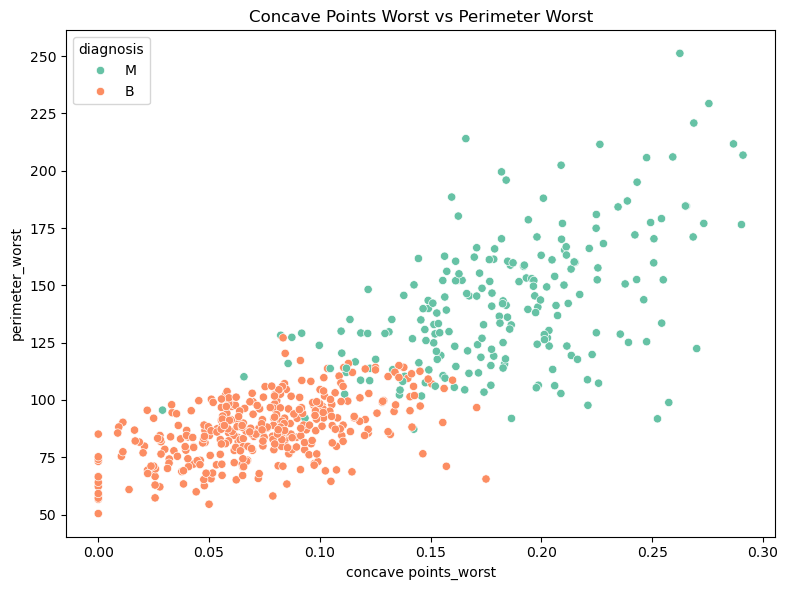

# 🔬 Breast Cancer Diagnosis System

XGBoost-based binary classification system that predicts whether a breast tumor is malignant or benign. Built with a FastAPI backend and a clean clinical-style web interface.

---

## 📸 Project Visuals

### 🖥️ Web Interface





### 📊 Model Analysis Graphs

**1. Feature Correlation with Target**


**2. Tumor Distribution**


**3. Concave Points vs Perimeter (Scatter)**


---

## 📂 File Structure

```text
cancer-diagnosis-ml/
│
├── web/
│   ├── web_images/         # Interface screenshots
│   ├── index.html          # Web interface
│   ├── style.css           # Styles
│   └── app.js              # Form logic and API connection
│
├── model_graphs/           # EDA graphs generated during training
│
├── main.ipynb              # Model training notebook (EDA, CV, hyperparameter search)
├── main.py                 # FastAPI endpoints
├── schemas.py              # Input data model (30 features)
├── cancer_pipeline.pkl     # Trained model (generated after running notebook)
└── requirements.txt        # Dependencies
```

---

## ⚙️ Installation

```bash
pip install -r requirements.txt
```

---

## 🚀 Usage

```bash
# 1. Run main.ipynb to train and save the model

# 2. Start the API
uvicorn main:app --reload

# 3. Open web/index.html in your browser
```

---

## 🔌 API

| Method | Endpoint | Description |
|--------|----------|-------------|
| `POST` | `/tahmin-et` | Submit 30 cell nucleus features, receive diagnosis (0: Benign, 1: Malignant) |
| `GET`  | `/docs` | Swagger UI |

---

## 📊 Dataset & Model

- **Source:** Breast Cancer Wisconsin (Diagnostic) — UCI ML Repository
- **Samples:** 569 · **Features:** 30
- **Classes:** Benign 357 (62.7%) / Malignant 212 (37.3%)
- **Algorithm:** XGBoost + StandardScaler Pipeline
- **Optimization:** 5-Fold CV, RandomizedSearchCV (scoring = Recall)
- **Decision Threshold:** 0.20 (minimizes false negatives)

| Metric | Score |
|--------|-------|
| ROC-AUC | 0.9931 |
| Recall | 0.9762 |
| False Negatives | 1 / 42 |

> Threshold set to 0.20 to prioritize minimizing missed malignant cases (false negatives) over false alarms.
